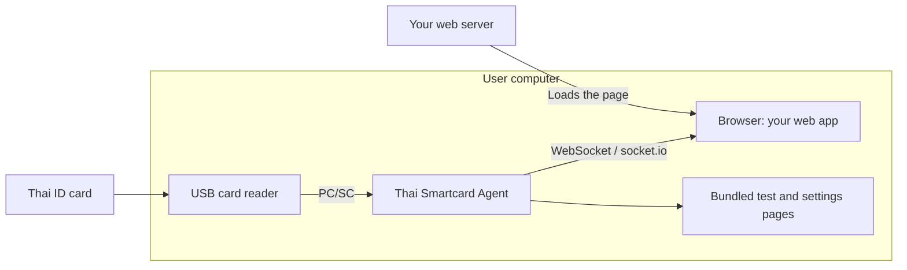

# go-thai-smartcard

Read Thai national ID cards and send the data to your web app over WebSocket
or socket.io. Runs on Windows, macOS and Linux.

## How it works

Install the agent on the computer connected to the card reader. Your web page
connects directly to that agent, even when the page is hosted on another server.



The browser receives decoded card data after each read. Your app decides how to
use or submit it. The agent does not send it to your web server automatically.

## Install and try

1. Download the installer for your OS from [Releases](https://github.com/somprasongd/go-thai-smartcard/releases).
2. Install it on the computer with the reader, then connect the reader.
3. Open [localhost:9898](http://localhost:9898) and insert a card.

| OS | Package |
| --- | --- |
| Windows | `thai-smartcard-setup-<version>.exe` |
| macOS | `thai-smartcard-agent-<version>.pkg` |
| Linux | Agent `.deb` or `.rpm`; install the tray package separately if needed |

For Debian/Ubuntu, install the downloaded agent package with:

```sh
sudo apt install ./thai-smartcard-agent_<version>_amd64.deb
```

Open [Settings](http://localhost:9898/settings) to choose the reader, card fields
and connection settings. The default listens only on this computer, port `9898`,
with WebSocket enabled. The tray provides shortcuts to the page and service controls.

See [installation and service commands](docs/installation.md),
[reader troubleshooting](docs/readers.md) and [tray controls](docs/tray.md).

### Run from source

Requires Go 1.27+ and native PC/SC dependencies
([setup](docs/library.md#use-as-a-library)).

```sh
git clone https://github.com/somprasongd/go-thai-smartcard.git
cd go-thai-smartcard
go mod download
go run ./cmd/record -list
make dev
```

Then open [localhost:9898](http://localhost:9898). `make dev` uses
`config.dev.toml`, created with defaults on first run.

## Connect your web app

Run this in a page on the same computer as the agent. No extra JavaScript
library is needed for WebSocket. This minimal example displays the name and
clears it when the card is removed or the connection closes.

```html
<p id="card-name">Waiting for a card…</p>
<script>
  const name = document.getElementById('card-name');
  const socket = new WebSocket('ws://127.0.0.1:9898/ws');

  socket.onmessage = ({ data }) => {
    const { event, payload } = JSON.parse(data);
    if (event === 'smc-data') {
      name.textContent = payload.personal.name.full_name;
    } else if (event === 'smc-removed') {
      name.textContent = 'Waiting for a card…';
    } else if (event === 'smc-error') {
      name.textContent = payload.message;
    }
  };
  socket.onclose = () => { name.textContent = 'Agent disconnected'; };
  socket.onerror = () => { name.textContent = 'Cannot connect to agent'; };
</script>
```

`127.0.0.1` is the **browser's computer**, not your web server. For a reader on
another computer, use that agent's address and enable network access in Settings;
a token is required. Restrict `allowed_origins` to your app's origin in Settings.

HTTPS pages may need `wss://` with a trusted certificate, and browsers may ask
for local-network permission. See [browser setup](docs/web-client.md#browsers)
before deploying. The example connects once; add reconnection and connection
state handling in your app.

For payload fields, tokens, commands and the socket.io **4.x** example, see
[Web client integration](docs/web-client.md). socket.io must be enabled in Settings.
Settings and `/api/*` are local management endpoints; web apps receive card data
through the sockets.

## Use in Go

Import `github.com/somprasongd/go-thai-smartcard/pkg/smc` to read cards directly
in your own Go program. See [library installation](docs/library.md) and the
[standalone example](examples/read-card/main.go), which handles errors and closes
the transport. The guide pins a current revision because `@latest` resolves to
the older v1 API.

## More documentation

| Topic | Guide |
| --- | --- |
| Test page, display preferences and Settings | [Usage](docs/usage.md) |
| Config paths, TLS and log retention | [Configuration](docs/configuration.md) |
| Architecture, builds and synthetic tests | [Development](docs/development.md) |
| Moving from v2 | [Upgrade guide](docs/upgrading.md) |
| Release history | [Changelog](CHANGELOG.md) |

Other implementations: [Java](https://github.com/somprasongd/jThaiSmartCard) ·
[Node.js](https://github.com/somprasongd/thai-smartcard-nodejs)

Support via PromptPay: [QR code](https://bit.ly/3gusiz8)
